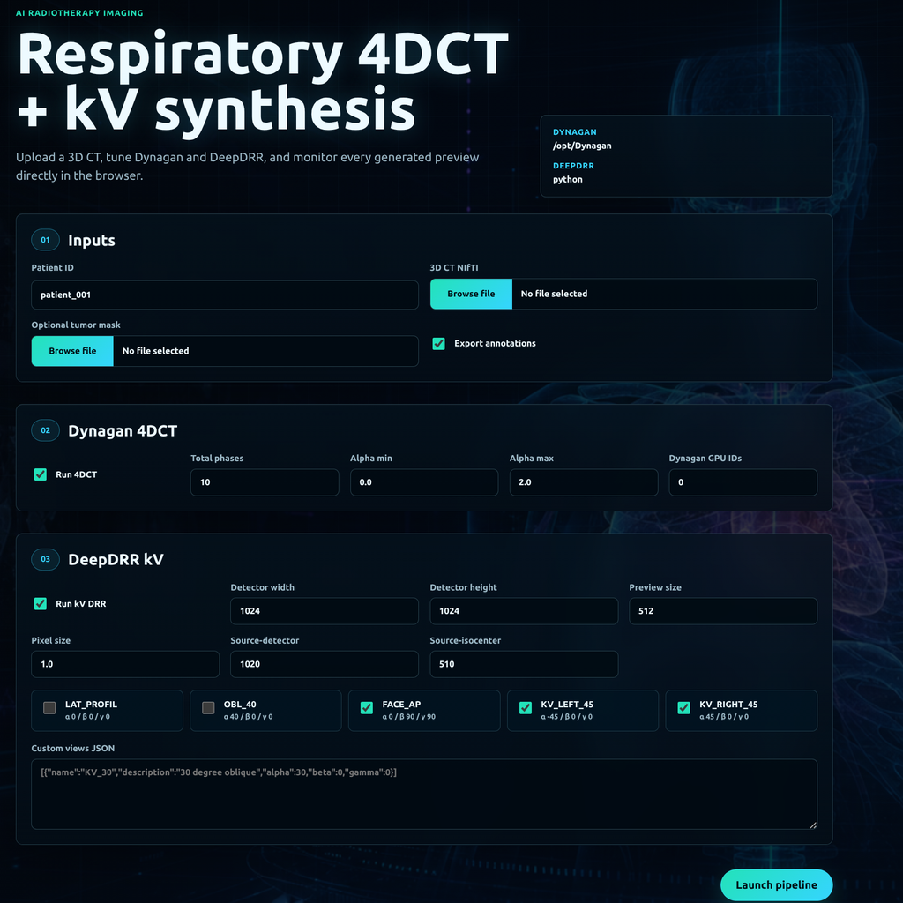
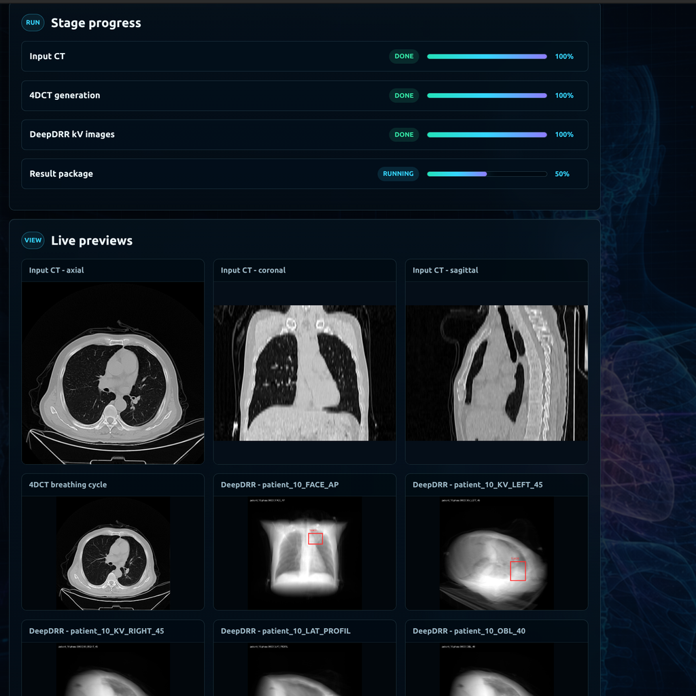
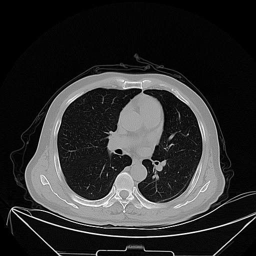
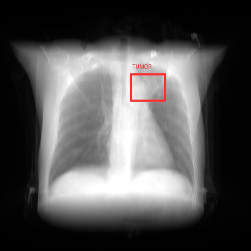

# Respiratory 4DCT + kV Synthesis

| Pipeline setup | Generated previews |
| --- | --- |
|  |  |

| Respiratory 4DCT | Face AP kV synthesis |
| --- | --- |
|  |  |

Web application to upload a 3D CT, generate respiratory 4DCT phases, and synthesize kV/DRR projections.

## Install And Run

Requirements:

- Linux workstation or GPU server
- NVIDIA GPU and NVIDIA driver
- Docker
- NVIDIA Container Toolkit

Check that Docker can access the GPU:

```bash
sudo docker run --rm --runtime=nvidia nvidia/cuda:11.8.0-runtime-ubuntu22.04 nvidia-smi
```

Clone and start the application:

```bash
git clone https://github.com/elia-kam/4dct-kv-synthesis.git
cd 4dct-kv-synthesis
sudo docker compose up --build
```

Open the app:

```text
http://localhost:8080
```

For later runs, after the image is already built:

```bash
sudo docker compose up
```

Notes:

- The first build can take a long time because it installs CUDA Python packages, Dynagan, DeepDRR, and the pretrained model.
- `DYNAGAN_THREADS` is set in `.env`.
- In the web form, Dynagan GPU IDs can be `0`, `0,1`, or `-1` for CPU.
- Results are available as a downloadable zip from the job page.

This project uses:

- Dynagan: https://github.com/cyiheng/Dynagan
- DeepDRR: https://github.com/arcadelab/deepdrr
